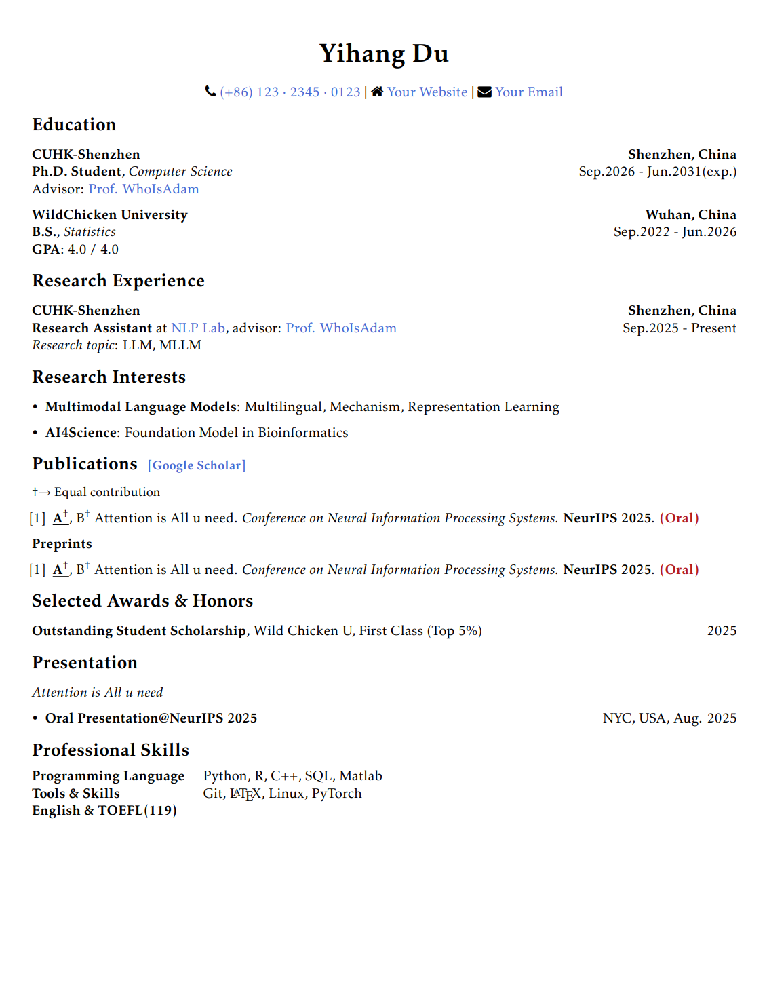

# Yih's CV LaTex Template

## Usage
Use the template in [overleaf](https://www.overleaf.com/). ~~Too lazy to provide local compilation guide.~~ 

## Screenshots

You can also see [My personal CV](https://yihdu.github.io/assets/files/CV_yihdu.pdf).

## Todo
- [ ]  add ZH version
- [ ]  local complation option

## Acknowledgments

- [Medium Length Professional CV](https://www.latextemplates.com/template/medium-length-professional-cv)
- Some inspiration from [Here](https://mars-tin.github.io/).

## Contact Me
Any feedback, feel free to contact [duyihangzjj@163.com](mailto:duyihangzjj@163.com).
